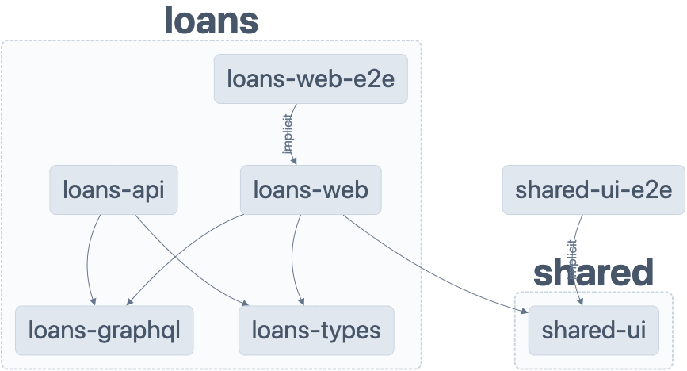

# Immo

## Inhaltsverzeichnis

- [Immo](#immo)
  - [Inhaltsverzeichnis](#inhaltsverzeichnis)
  - [Voraussetzungen](#voraussetzungen)
  - [Schneller Einstieg](#schneller-einstieg)
    - [Installierung](#installierung)
    - [Start Dev-Server](#start-dev-server)
  - [Deployments](#deployments)
    - [Live-Demo](#live-demo)
    - [Design System](#design-system)
    - [Visuelle Regressiontests](#visuelle-regressiontests)
  - [Tech Stack](#tech-stack)
  - [Struktur](#struktur)
  - [Start einzelne Apps](#start-einzelne-apps)
    - [Loans Api (Backend)](#loans-api-backend)
    - [Loans Web (Frontend)](#loans-web-frontend)
  - [Integration-Tests](#integration-tests)
  - [E2E Tests](#e2e-tests)
  - [UI Library](#ui-library)
  - [Workspace verstehen](#workspace-verstehen)
  - [Remote caching](#remote-caching)

---

## Voraussetzungen

- [Node.js](https://nodejs.org/en/) (v18.12.1)
- [npm](https://www.npmjs.com/) (v8.19.2)

  ```sh
    # empfohlene Node-Versionierung: https://github.com/nvm-sh/nvm#installing-and-updating

    # node installieren
    nvm install 18.12.1
    # node version prüfen
    nvm use

    # npm version prüfen
    npm -v
    ## soll 8.19.2 sein, wenn nicht:
    npm install npm@8.19.2 -g

    # note
    ## man kann `nvm use` tippen, um später die richtige node version zu verwenden
  ```

## Schneller Einstieg

### Installierung

```sh
# dependencies installieren
npm install

# Anmerkung: Wegen der Storybook-Deps sieht man Dependency-Warnungen beim Installation.
#            Wenn Storybook v7 bereit ist, werden die Warnungen weg sein
#            Storybook ist nur ein Dev-Dependency, also wird es nicht in einer Produktion-App benutzt.
```

### Start Dev-Server

```sh
## start die Backend und Frontend Servers in Parallel für die Default App (Loans)
npm run dev

## http://localhost:4200 - web (frontend)
## http://localhost:3333 - api (backend)
```

Anmerkung:

Man kann die GraphQL Api suchen und testen mit [GraphQL Playground](https://www.apollographql.com/docs/apollo-server/testing/graphql-playground/).

http://localhost:3333/graphql - GraphQL Playground

---

## Deployments

### Live-Demo

[](https://tilgungsrechner.vercel.app)

### Design System

[](https://mushy-purpose.surge.sh/)

### Visuelle Regressiontests

[](https://www.chromatic.com/setup?appId=63a2a22702057acaa944445f)

---

## Tech Stack

- [nx](https://nx.dev) - Monorepo
- [nestjs](https://nestjs.com/) - Backend
- [next.js](https://nextjs.org/) - Frontend
- [typescript](https://www.typescriptlang.org/) - Typisierung
- [jest](https://jestjs.io/) - Tests
- [cypress](https://www.cypress.io/) - E2E Tests
- [vercel](https://vercel.com/) - Deployment
- [eslint](https://eslint.org/) - Linter
- [prettier](https://prettier.io/) - Formatter
- [storybook](https://storybook.js.org/) - UI Komponenten
- [chromatic](https://www.chromatic.com/) - UI Komponenten visuelle Regressiontests

---

## Struktur

Loans Api (Backend) und Loans Web (Frontend) sind zwei Apps, die in einem Monorepo sind. Die Apps sind in zwei Workspaces aufgeteilt: `apps` und `libs`.

[](./graph.png)

## Start einzelne Apps

### Loans Api (Backend)

```sh
npm run dev:api
```

### Loans Web (Frontend)

```sh
npm run dev:web
```

---

## Integration-Tests

```sh
npm run test
```

## E2E Tests

```sh
npm run e2e
```

---

## UI Library

```sh
## startet storybook (wenn nötig, wird es auch die Dependencies installieren)
npm run storybook:dev
```

---

## Workspace verstehen

`npm run graph` ausführen um ein Diagramm der Projektabhängigkeiten zu sehen.

## Remote caching

Run `npx nx connect-to-nx-cloud` to enable [remote caching](https://nx.app) and make CI faster.
